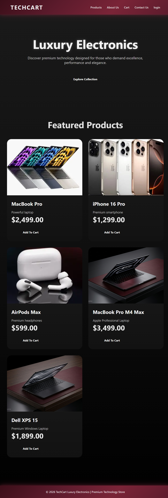
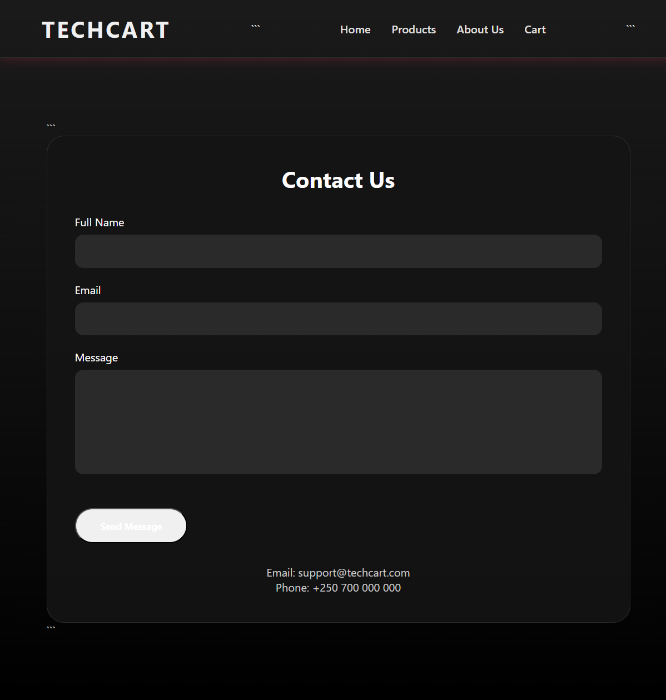
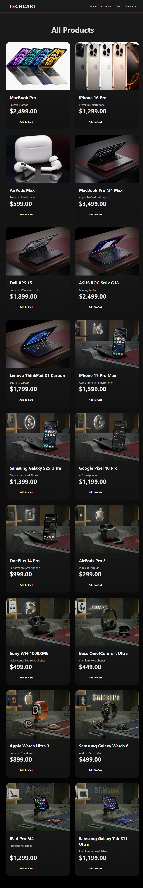
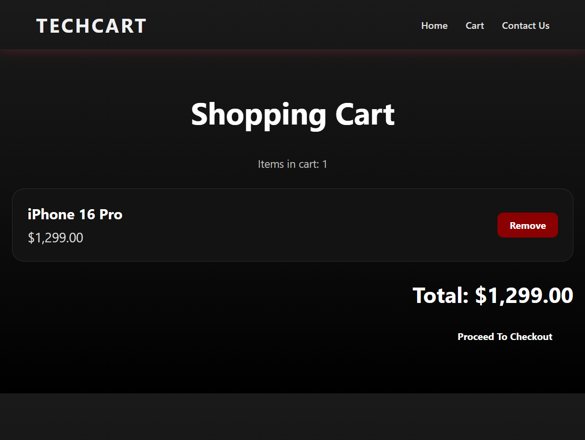
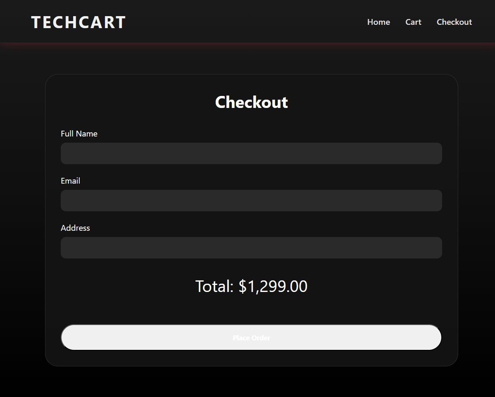
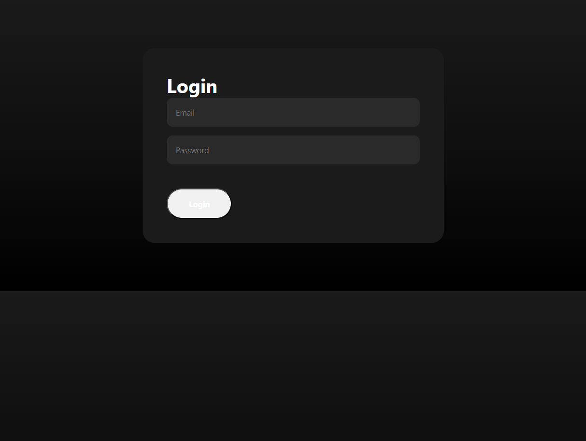
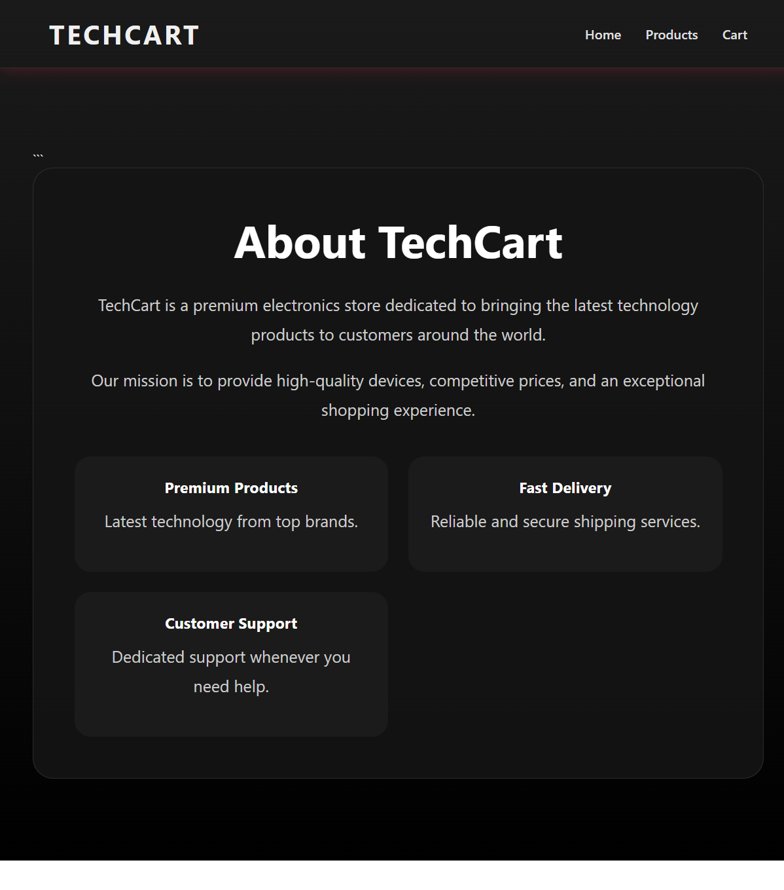

# TechCart# TechCart E-Commerce Store

## Final Project Report

### Student Information

Name: Mohammed Ali

Course: EWA408510 – E-Commerce and Web Application

Project Title: TechCart E-Commerce Store

GitHub Repository:
https://github.com/mohammedali2432006-netizen/TechCart

---

## Project Overview

TechCart is a web-based e-commerce application developed using PHP, MySQL, Docker, HTML, and CSS. The platform allows users to browse products, view product details, add items to a shopping cart, register accounts, log in, and complete the checkout process.

The project was developed following e-commerce development principles and demonstrates database integration, user authentication, session management, and responsive web design.

---

## Technologies Used

* PHP
* MySQL
* HTML5
* CSS3
* Docker
* Git
* GitHub
* phpMyAdmin

---

## Features Implemented

### Product Management

* Display featured products on the homepage.
* Browse all products through the Products page.
* Product details page for each item.
* Product images and descriptions.

### Shopping Cart

* Add products to cart.
* View cart contents.
* Calculate total order value.
* Proceed to checkout.

### Checkout System

* Customer information form.
* Order summary.
* Total price calculation.

### User Authentication

* User registration.
* User login.
* Session management.
* User roles (Admin and User).

### Additional Pages

* Home Page
* Products Page
* Product Details Page
* Cart Page
* Checkout Page
* About Us Page
* Contact Us Page

---

## Database Design

The database contains the following tables:

### products

Stores product information:

* Product ID
* Name
* Description
* Price
* Image
* Category

### users

Stores user account information:

* User ID
* Name
* Email
* Password
* Role (Admin/User)

### orders

Stores customer orders:

* Order ID
* User ID
* Total Amount
* Address
* Date

### order_items

Stores products associated with each order.

---

## Version Control

Git and GitHub were used to manage project development.

Commands used:

* git add .
* git commit -m "message"
* git push origin main
* git pull origin main

The repository was updated regularly throughout development.

GitHub Repository:
https://github.com/mohammedali2432006-netizen/TechCart

---

## Challenges Encountered

Several challenges were encountered during development:

1. Database connection issues between PHP and MySQL containers.
2. Docker networking configuration.
3. Shopping cart session handling.
4. Product image display issues.
5. User authentication implementation.
6. Navigation and UI design improvements.

These challenges were solved through debugging, testing, and configuration updates.

---

## Conclusion

The TechCart project successfully demonstrates the development of a functional e-commerce website using PHP, MySQL, Docker, Git, and GitHub. The system integrates product management, user authentication, shopping cart functionality, and checkout processing.

The project improved practical skills in web application development, database design, version control, and containerized deployment using Docker.
## Screenshots
### Home page

### Contact Us Page

### Product Page

### Cart Page

## Screenshots
### checkout page

### login Page

### about us Page

### Cart Page

